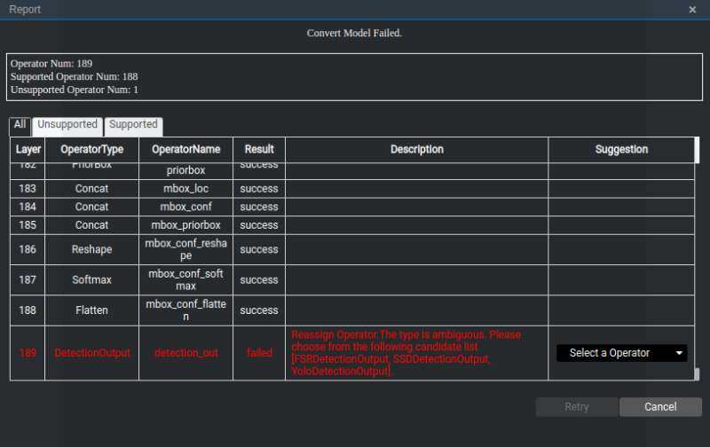

中文|[英文](README.md)

# 车辆检测<a name="ZH-CN_TOPIC_0185838100"></a>

开发者将本Application部署至Atlas 200 DK或者AI加速云服务器上实现对本地mp4文件或者RTSP视频流进行解码，对视频帧中的车辆并对其属性进行预测，生成结构化信息发送至Server端进行保存、展示的功能。

## 前提条件<a name="zh-cn_topic_0182554635_section137245294533"></a>

部署此Sample前，需要准备好以下环境：

-   已完成Mind Studio的安装。
-   已完成Atlas 200 DK开发者板与Mind Studio的连接，交叉编译器的安装，SD卡的制作及基本信息的配置等。

## 软件准备<a name="zh-cn_topic_0182554635_section8534138124114"></a>

运行此Sample前，需要按照此章节获取源码包，并进行相关的环境配置。

1.  获取源码包。

    将[https://gitee.com/Atlas200DK/sample-videoanalysiscar](https://gitee.com/Atlas200DK/sample-videoanalysiscar)仓中的代码以Mind Studio安装用户下载至Mind Studio所在Ubuntu服务器的任意目录，例如代码存放路径为：$HOME/sample-videoanalysiscar。

2.  <a name="zh-cn_topic_0182554635_li8221184418455"></a>获取此应用中所需要的原始网络模型。

    参考[表1](#zh-cn_topic_0182554635_table117203103464)获取此应用中所用到的原始网络模型及其对应的权重文件，并将其存放到Mind Studio所在Ubuntu服务器的任意目录，例如：$HOME/ascend/models/videoanalysiscar。

    **表 1**  车辆检测应用中使用的模型

    <a name="zh-cn_topic_0182554635_table117203103464"></a>
    <table><thead align="left"><tr id="zh-cn_topic_0182554635_row4859191074617"><th class="cellrowborder" valign="top" width="17.32173217321732%" id="mcps1.2.4.1.1"><p id="zh-cn_topic_0182554635_p18859111074613"><a name="zh-cn_topic_0182554635_p18859111074613"></a><a name="zh-cn_topic_0182554635_p18859111074613"></a>模型名称</p>
    </th>
    <th class="cellrowborder" valign="top" width="9.68096809680968%" id="mcps1.2.4.1.2"><p id="zh-cn_topic_0182554635_p17859171013469"><a name="zh-cn_topic_0182554635_p17859171013469"></a><a name="zh-cn_topic_0182554635_p17859171013469"></a>模型说明</p>
    </th>
    <th class="cellrowborder" valign="top" width="72.997299729973%" id="mcps1.2.4.1.3"><p id="zh-cn_topic_0182554635_p1385991094614"><a name="zh-cn_topic_0182554635_p1385991094614"></a><a name="zh-cn_topic_0182554635_p1385991094614"></a>模型下载路径</p>
    </th>
    </tr>
    </thead>
    <tbody><tr id="zh-cn_topic_0182554635_row1085921012469"><td class="cellrowborder" valign="top" width="17.32173217321732%" headers="mcps1.2.4.1.1 "><p id="zh-cn_topic_0182554635_p168591710184613"><a name="zh-cn_topic_0182554635_p168591710184613"></a><a name="zh-cn_topic_0182554635_p168591710184613"></a>car_color</p>
    </td>
    <td class="cellrowborder" valign="top" width="9.68096809680968%" headers="mcps1.2.4.1.2 "><p id="zh-cn_topic_0182554635_p118591410204619"><a name="zh-cn_topic_0182554635_p118591410204619"></a><a name="zh-cn_topic_0182554635_p118591410204619"></a>车辆颜色识别模型。</p>
    </td>
    <td class="cellrowborder" valign="top" width="72.997299729973%" headers="mcps1.2.4.1.3 "><p id="zh-cn_topic_0182554635_p11859310174613"><a name="zh-cn_topic_0182554635_p11859310174613"></a><a name="zh-cn_topic_0182554635_p11859310174613"></a>请参考<a href="https://gitee.com/HuaweiAscend/models/tree/master/computer_vision/classification/car_color" target="_blank" rel="noopener noreferrer">https://gitee.com/HuaweiAscend/models/tree/master/computer_vision/classification/car_color</a>目录中README.md下载原始网络模型文件及其对应的权重文件。</p>
    </td>
    </tr>
    <tr id="zh-cn_topic_0182554635_row78596105463"><td class="cellrowborder" valign="top" width="17.32173217321732%" headers="mcps1.2.4.1.1 "><p id="zh-cn_topic_0182554635_p118591910104615"><a name="zh-cn_topic_0182554635_p118591910104615"></a><a name="zh-cn_topic_0182554635_p118591910104615"></a>car_type</p>
    </td>
    <td class="cellrowborder" valign="top" width="9.68096809680968%" headers="mcps1.2.4.1.2 "><p id="zh-cn_topic_0182554635_p1685991044614"><a name="zh-cn_topic_0182554635_p1685991044614"></a><a name="zh-cn_topic_0182554635_p1685991044614"></a>车辆品牌识别模型。</p>
    <p id="zh-cn_topic_0182554635_p13859410184613"><a name="zh-cn_topic_0182554635_p13859410184613"></a><a name="zh-cn_topic_0182554635_p13859410184613"></a>基于Caffe的GoogleNet模型。</p>
    </td>
    <td class="cellrowborder" valign="top" width="72.997299729973%" headers="mcps1.2.4.1.3 "><p id="zh-cn_topic_0182554635_p1985915105461"><a name="zh-cn_topic_0182554635_p1985915105461"></a><a name="zh-cn_topic_0182554635_p1985915105461"></a>请参考<a href="https://gitee.com/HuaweiAscend/models/tree/master/computer_vision/classification/car_type" target="_blank" rel="noopener noreferrer">https://gitee.com/HuaweiAscend/models/tree/master/computer_vision/classification/car_type</a>目录中README.md下载原始网络模型文件及其对应的权重文件。</p>
    </td>
    </tr>
    <tr id="zh-cn_topic_0182554635_row1985913103461"><td class="cellrowborder" valign="top" width="17.32173217321732%" headers="mcps1.2.4.1.1 "><p id="zh-cn_topic_0182554635_p14859151016464"><a name="zh-cn_topic_0182554635_p14859151016464"></a><a name="zh-cn_topic_0182554635_p14859151016464"></a>car_plate_detection</p>
    </td>
    <td class="cellrowborder" valign="top" width="9.68096809680968%" headers="mcps1.2.4.1.2 "><p id="zh-cn_topic_0182554635_p108593100461"><a name="zh-cn_topic_0182554635_p108593100461"></a><a name="zh-cn_topic_0182554635_p108593100461"></a>车牌检测网络模型。</p>
    <p id="zh-cn_topic_0182554635_p1785921024614"><a name="zh-cn_topic_0182554635_p1785921024614"></a><a name="zh-cn_topic_0182554635_p1785921024614"></a>基于Caffe的Mobilenet-SSD模型。</p>
    </td>
    <td class="cellrowborder" valign="top" width="72.997299729973%" headers="mcps1.2.4.1.3 "><p id="zh-cn_topic_0182554635_p158596106460"><a name="zh-cn_topic_0182554635_p158596106460"></a><a name="zh-cn_topic_0182554635_p158596106460"></a>请参考<a href="https://gitee.com/HuaweiAscend/models/tree/master/computer_vision/object_detect/car_plate_detection" target="_blank" rel="noopener noreferrer">https://gitee.com/HuaweiAscend/models/tree/master/computer_vision/object_detect/car_plate_detection</a>目录中README.md下载原始网络模型文件及其对应的权重文件。</p>
    </td>
    </tr>
    <tr id="zh-cn_topic_0182554635_row08596101464"><td class="cellrowborder" valign="top" width="17.32173217321732%" headers="mcps1.2.4.1.1 "><p id="zh-cn_topic_0182554635_p178591510164619"><a name="zh-cn_topic_0182554635_p178591510164619"></a><a name="zh-cn_topic_0182554635_p178591510164619"></a>car_plate_recognition</p>
    </td>
    <td class="cellrowborder" valign="top" width="9.68096809680968%" headers="mcps1.2.4.1.2 "><p id="zh-cn_topic_0182554635_p1485911105469"><a name="zh-cn_topic_0182554635_p1485911105469"></a><a name="zh-cn_topic_0182554635_p1485911105469"></a>车牌号码识别网络模型。</p>
    <p id="zh-cn_topic_0182554635_p17859191018468"><a name="zh-cn_topic_0182554635_p17859191018468"></a><a name="zh-cn_topic_0182554635_p17859191018468"></a>基于Caffe的CNN模型。</p>
    </td>
    <td class="cellrowborder" valign="top" width="72.997299729973%" headers="mcps1.2.4.1.3 "><p id="zh-cn_topic_0182554635_p7859181094619"><a name="zh-cn_topic_0182554635_p7859181094619"></a><a name="zh-cn_topic_0182554635_p7859181094619"></a>请参考<a href="https://gitee.com/HuaweiAscend/models/tree/master/computer_vision/classification/car_plate_recognition" target="_blank" rel="noopener noreferrer">https://gitee.com/HuaweiAscend/models/tree/master/computer_vision/classification/car_plate_recognition</a>目录中README.md下载原始网络模型文件及其对应的权重文件。</p>
    </td>
    </tr>
    <tr id="zh-cn_topic_0182554635_row88591310124617"><td class="cellrowborder" valign="top" width="17.32173217321732%" headers="mcps1.2.4.1.1 "><p id="zh-cn_topic_0182554635_p685911013465"><a name="zh-cn_topic_0182554635_p685911013465"></a><a name="zh-cn_topic_0182554635_p685911013465"></a>vgg_ssd</p>
    </td>
    <td class="cellrowborder" valign="top" width="9.68096809680968%" headers="mcps1.2.4.1.2 "><p id="zh-cn_topic_0182554635_p1786011016461"><a name="zh-cn_topic_0182554635_p1786011016461"></a><a name="zh-cn_topic_0182554635_p1786011016461"></a>目标检测网络模型。</p>
    <p id="zh-cn_topic_0182554635_p086018109465"><a name="zh-cn_topic_0182554635_p086018109465"></a><a name="zh-cn_topic_0182554635_p086018109465"></a>基于Caffe的SSD512模型。</p>
    </td>
    <td class="cellrowborder" valign="top" width="72.997299729973%" headers="mcps1.2.4.1.3 "><p id="zh-cn_topic_0182554635_p1186071044613"><a name="zh-cn_topic_0182554635_p1186071044613"></a><a name="zh-cn_topic_0182554635_p1186071044613"></a>请参考<a href="https://gitee.com/HuaweiAscend/models/tree/master/computer_vision/object_detect/vgg_ssd" target="_blank" rel="noopener noreferrer">https://gitee.com/HuaweiAscend/models/tree/master/computer_vision/object_detect/vgg_ssd</a>目录中README.md下载原始网络模型文件及其对应的权重文件。</p>
    </td>
    </tr>
    </tbody>
    </table>

3.  将原始网络模型转换为Davinci模型。
    1.  在Mind Studio操作界面的顶部菜单栏中选择“Tool \> Convert Model”，进入模型转换界面。
    2.  在弹出的**Convert Model**操作界面中，Model File与Weight File分别选择[2](#zh-cn_topic_0182554635_li8221184418455)中下载的模型文件和权重文件。

        -   Model Name填写为[表1](#zh-cn_topic_0182554635_table117203103464)对应的**模型名称**。
        -   car\_color模型中car\_color\_inference一次处理10张图片，所以转换时需要将Input Shape的N修改为10。

            car\_type模型中car\_type\_inference一次处理10张图片，所以转换时需要将Input Shape的N修改为10。

        -   其他参数保持默认值。

        **图 1**  Input Shape配置示例<a name="zh-cn_topic_0182554635_fig09711548135116"></a>  
        

    3.  单击**OK**开始转换模型。

        car\_plate\_detection、vgg\_ssd模型在转换的时候，会有报错，错误信息如下图所示。

        **图 2**  模型转换错误<a name="zh-cn_topic_0182554635_fig1842765585311"></a>  
        

        此时在DetectionOutput层的Suggestion中选择SSDDetectionOutput，并点击Retry。

        模型转换成功后，后缀为.om的Davinci模型存放地址为：$HOME/tools/che/model-zoo/my-model/xxx。


4.  将转换好的模型文件（.om文件）上传到“sample-videoanalysiscar/script”目录下。
5.  以Mind Studio安装用户登录Mind Studio所在Ubuntu服务器，并设置环境变量DDK\_HOME。

    **vim \~/.bashrc**

    执行如下命令在最后一行添加DDK\_HOME及LD\_LIBRARY\_PATH的环境变量。

    **export DDK\_HOME=$HOME/tools/che/ddk/ddk**

    **export LD\_LIBRARY\_PATH=$DDK\_HOME/uihost/lib**

    > **说明：**     
    >-   如果此环境变量已经添加，则此步骤可跳过。  

    输入:wq!保存退出。

    执行如下命令使环境变量生效。

    **source \~/.bashrc**


## 部署<a name="zh-cn_topic_0182554635_section1759513564117"></a>

1.  以Mind Studio安装用户进入车辆检测应用代码所在根目录，如：**$HOME/sample-videoanalysiscar**。
2.  <a name="zh-cn_topic_0182554635_li08019112542"></a>执行部署脚本，进行工程环境准备，包括ascenddk公共库的编译与部署、Presenter Server服务器的配置等操作，其中Presenter Server用于接收Application发送过来的数据并通过浏览器进行结果展示。

    **bash deploy.sh** _host\_ip_ _model\_mode_

    -   _host\_ip_：对于Atlas 200 DK开发者板，即为开发者板的IP地址。对于AI加速云服务器，即为Host侧的IP地址。

    -   model\_mode代表模型文件的部署方式，默认为internet。
        -   local：若Mind Studio所在Ubuntu系统未连接网络，请使用local模式，执行此命令前，需要参考[依赖代码库下载](#zh-cn_topic_0182554635_section13807155164319)将依赖代码库的下载到“sample-videoanalysiscar/script“目录下。
        -   internet：若Mind Studio所在Ubuntu系统已连接网络，请使用internet模式，在线下载依赖代码库的下载。


    命令示例：

    **bash deploy.sh 192.168.1.2 internet**

    -   当提示“Please choose one to show the presenter in browser\(default: 127.0.0.1\):“时，请输入在浏览器中访问Presenter Server服务所使用的IP地址（一般为访问Mind Studio的IP地址）。
    -   当提示“Please input a absolute path to storage video analysis data:“时，请输入Mind Studio中的绝对路径用于存储视频解析数据，此路径Mind Studio用户需要有读写权限，若此路径不存在，脚本会自动创建。

    如[图3](#zh-cn_topic_0182554635_fig184321447181017)所示，请在“Current environment valid ip list“中选择通过浏览器访问Presenter Server服务使用的IP地址，并输入存储视频解析数据的路径。

    **图 3**  工程部署示意图<a name="zh-cn_topic_0182554635_fig184321447181017"></a>  
    

3.  <a name="zh-cn_topic_0182554635_li499911453439"></a>启动Presenter Server。

    执行如下命令在后台启动Video Analysis应用的Presenter Server主程序。

    **python3 presenterserver/presenter\_server.py --app video\_analysis\_car &**

    > **说明：**   
    >“presenter\_server.py“在当前目录的“presenterserver“目录下，可以在此目录下执行**python3 presenter\_server.py -h**或者**python3 presenter\_server.py --help**查看“presenter\_server.py“的使用方法。  

    如[图4](#zh-cn_topic_0182554635_fig69531305324)所示，表示presenter\_server的服务启动成功。

    **图 4**  Presenter Server进程启动<a name="zh-cn_topic_0182554635_fig69531305324"></a>  
    

    使用上图提示的URL登录Presenter Server，仅支持Chrome浏览器，IP地址为[2](#zh-cn_topic_0182554635_li08019112542)中输入的IP地址，端口号默为7005，如下图所示，表示Presenter Server启动成功。

    **图 5**  主页显示<a name="zh-cn_topic_0182554635_fig64391558352"></a>  
    

    Presenter Server、Mind Studio与Atlas 200 DK之间通信使用的IP地址示例如下图所示：

    **图 6**  IP地址示例<a name="zh-cn_topic_0182554635_fig1881532172010"></a>  
    

    -   Atlas 200 DK开发者板使用的IP地址为192.168.1.2（USB方式连接）。
    -   Presenter Server与Atlas 200 DK通信的IP地址为UI Host服务器中与Atlas 200 DK在同一网段的IP地址，例如：192.168.1.223。
    -   通过浏览器访问Presenter Server的IP地址本示例为：10.10.0.1，由于Presenter Server与Mind Studio部署在同一服务器，此IP地址也为通过浏览器访问Mind Studio的IP。

4.  视频结构化应用支持解析本地视频和RTSP视频流。
    -   如果需要解析本地视频，需要将视频文件传到Host侧。

        例如将视频文件car.mp4上传到Host侧的“/home/HwHiAiUser/sample“目录下。

        > **说明：**   
        >支持H264与H265格式的MP4文件，如果MP4文件需要剪辑，建议使用开源工具ffmpeg，使用其他工具剪辑的视频文件ffmpeg工具可能不支持解析。  

    -   如果仅解析RTSP视频流，本步骤可跳过。


## 运行<a name="zh-cn_topic_0182554635_section6245151616426"></a>

1.  运行Video Analysis程序。

    在“$HOME/sample-videoanalysiscar“目录下执行如下命令运行Video Analysis应用程序。

    **bash run\_videoanalysiscarapp.sh** _host\_ip_ _presenter\_view\_appname_ _channel1_ _[channel2]_   &

    -   _host\_ip_：对于Atlas 200 DK开发者板，即为开发者板的IP地址。对于AI加速云服务器，即为Host侧的IP地址。
    -   _presenter\_view\_app\_name_：用户自定义的在Presenter Server界面展示的View Name，此View Name需要在Presenter Server展示界面唯一，只能是大小写字母、数字、“_”的组合，位数3-20。
    -   _channel1_：为Host侧的视频文件的绝对路径，需要加上双引号.当只存在视频文件时。Channel2可以省略。
    -   _channel2_：为RTSP视频流的URL,需要加上双引号。当只存在RTSP视频流时需要使用” ”对channel1进行占位。

    视频文件运行的命令示例如下所示：
    
    **bash run\_videoanalysiscarapp.sh 192.168.1.2 video "/home/HwHiAiUser/sample/car.mp4" &**
    
    RTSP视频流的命令实例如下所示：
    
    **bash run\_videoanalysiscarapp.sh 192.168.1.2 video " "  "rtsp://192.168.2.37:554/cam/realmonitor?channel=1&subtype=0" &**
    
    > **说明：**   
    >当前RTSP视频流只支持rtsp://ip:port/path格式，如果需要使用其它格式的url，需要把video\_decode.cpp中的IsValidRtsp函数去除，或者直接返回true，跳过正则表达式匹配。

2.  使用启动Presenter Server服务时提示的URL登录 Presenter Server 网站（仅支持Chrome浏览器），详细可参考[3](#zh-cn_topic_0182554635_li499911453439)。

    > **说明：**   
    >Video Analysis的Presenter Server最多支持2个presenter\_view\_app\_name同时显示。  

    页面左侧树结构列出了视频所属app name以及通道名，中间列出了抽取的视频帧大图以及检测出的目标小图，点击下方小图后会在右侧列出详细的推理结果、评分。

    本应用支持车辆属性检测，包括车辆品牌、车辆颜色的识别和车牌号码识别。

    > **说明：**   
    >车牌号码识别的网络模型，是通过程序自动生成的车牌作为训练集图片训练的，不是使用真实车牌图片训练的。所以该模型在识别真实车牌号码时准确度比较低，如果需要较高的准确度的模型，请自己搜集真实车牌图片作为训练集并训练。  


## 后续处理<a name="zh-cn_topic_0182554635_section1092612277429"></a>

-   **停止视频结构化应用**

    若要停止视频结构化应用程序，可执行如下操作。

    以Mind Studio安装用户在sample-videoanalysiscar目录下执行如下命令：

    **bash stop\_videoanalysiscarapp.sh** _host\_ip_

    _host\_ip_：对于Atlas 200 DK开发者板，即为开发者板的IP地址。对于AI加速云服务器，即为Host的IP地址。。

    命令示例：

    **bash stop\_videoanalysiscarapp.sh** _192.168.1.2_

-   **停止Presenter Server服务**

    Presenter Server服务启动后会一直处于运行状态，若想停止视频结构化应用对应的Presenter Server服务，可执行如下操作。

    以Mind Studio安装用户在Mind Studio所在服务器中执行如下命令查看视频结构化应用对应的Presenter Server服务的进程。

    **ps -ef | grep presenter | grep video\_analysis\_car**

    ```
    ascend@ascend-HP-ProDesk-600-G4-PCI-MT:~/sample-videoanalysiscar$ ps -ef | grep presenter | grep video_analysis_car
    ascend 3655 20313 0 15:10 pts/24?? 00:00:00 python3 presenterserver/presenter_server.py --app video_analysis_car
    ```

    如上所示  _3655_  即为车辆检测应用对应的Presenter Server服务的进程ID。

    若想停止此服务，执行如下命令：

    **kill -9** _3655_


## 依赖代码库下载<a name="zh-cn_topic_0182554635_section13807155164319"></a>

将依赖的软件库下载到“sample-videoanalysiscar/script“目录下。

**表 2**  依赖代码库下载

<a name="zh-cn_topic_0182554635_table11339161214583"></a>
<table><thead align="left"><tr id="zh-cn_topic_0182554635_row43391112135817"><th class="cellrowborder" valign="top" width="33.33333333333333%" id="mcps1.2.4.1.1"><p id="zh-cn_topic_0182554635_p13395121583"><a name="zh-cn_topic_0182554635_p13395121583"></a><a name="zh-cn_topic_0182554635_p13395121583"></a>模块名称</p>
</th>
<th class="cellrowborder" valign="top" width="33.33333333333333%" id="mcps1.2.4.1.2"><p id="zh-cn_topic_0182554635_p433981216581"><a name="zh-cn_topic_0182554635_p433981216581"></a><a name="zh-cn_topic_0182554635_p433981216581"></a>模块描述</p>
</th>
<th class="cellrowborder" valign="top" width="33.33333333333333%" id="mcps1.2.4.1.3"><p id="zh-cn_topic_0182554635_p4339181265819"><a name="zh-cn_topic_0182554635_p4339181265819"></a><a name="zh-cn_topic_0182554635_p4339181265819"></a>下载地址</p>
</th>
</tr>
</thead>
<tbody><tr id="zh-cn_topic_0182554635_row1034014127588"><td class="cellrowborder" valign="top" width="33.33333333333333%" headers="mcps1.2.4.1.1 "><p id="zh-cn_topic_0182554635_p13340312145811"><a name="zh-cn_topic_0182554635_p13340312145811"></a><a name="zh-cn_topic_0182554635_p13340312145811"></a>EZDVPP</p>
</td>
<td class="cellrowborder" valign="top" width="33.33333333333333%" headers="mcps1.2.4.1.2 "><p id="zh-cn_topic_0182554635_p1334011245818"><a name="zh-cn_topic_0182554635_p1334011245818"></a><a name="zh-cn_topic_0182554635_p1334011245818"></a>对DVPP接口进行了封装，提供对图片/视频的处理能力。</p>
</td>
<td class="cellrowborder" valign="top" width="33.33333333333333%" headers="mcps1.2.4.1.3 "><p id="zh-cn_topic_0182554635_p4340112155815"><a name="zh-cn_topic_0182554635_p4340112155815"></a><a name="zh-cn_topic_0182554635_p4340112155815"></a><a href="https://gitee.com/Atlas200DK/sdk-ezdvpp" target="_blank" rel="noopener noreferrer">https://gitee.com/Atlas200DK/sdk-ezdvpp</a></p>
<p id="zh-cn_topic_0182554635_p18340012195812"><a name="zh-cn_topic_0182554635_p18340012195812"></a><a name="zh-cn_topic_0182554635_p18340012195812"></a>下载后请保持文件夹名称为ezdvpp。</p>
</td>
</tr>
<tr id="zh-cn_topic_0182554635_row14340191245813"><td class="cellrowborder" valign="top" width="33.33333333333333%" headers="mcps1.2.4.1.1 "><p id="zh-cn_topic_0182554635_p19340812135812"><a name="zh-cn_topic_0182554635_p19340812135812"></a><a name="zh-cn_topic_0182554635_p19340812135812"></a>Presenter Agent</p>
</td>
<td class="cellrowborder" valign="top" width="33.33333333333333%" headers="mcps1.2.4.1.2 "><p id="zh-cn_topic_0182554635_p734081285817"><a name="zh-cn_topic_0182554635_p734081285817"></a><a name="zh-cn_topic_0182554635_p734081285817"></a>与Presenter Server进行交互的API接口。</p>
</td>
<td class="cellrowborder" valign="top" width="33.33333333333333%" headers="mcps1.2.4.1.3 "><p id="zh-cn_topic_0182554635_p14340912175819"><a name="zh-cn_topic_0182554635_p14340912175819"></a><a name="zh-cn_topic_0182554635_p14340912175819"></a><a href="https://gitee.com/Atlas200DK/sdk-presenter/tree/master" target="_blank" rel="noopener noreferrer">https://gitee.com/Atlas200DK/sdk-presenter/tree/master</a></p>
<p id="zh-cn_topic_0182554635_p1334013129584"><a name="zh-cn_topic_0182554635_p1334013129584"></a><a name="zh-cn_topic_0182554635_p1334013129584"></a>请获取此路径下的presenteragent文件夹，下载后请保持文件夹名称为presenteragent。</p>
</td>
</tr>
<tr id="zh-cn_topic_0182554635_row63415125584"><td class="cellrowborder" valign="top" width="33.33333333333333%" headers="mcps1.2.4.1.1 "><p id="zh-cn_topic_0182554635_p1934181212587"><a name="zh-cn_topic_0182554635_p1934181212587"></a><a name="zh-cn_topic_0182554635_p1934181212587"></a>开源工具ffmpeg</p>
</td>
<td class="cellrowborder" valign="top" width="33.33333333333333%" headers="mcps1.2.4.1.2 "><p id="zh-cn_topic_0182554635_p23411912155813"><a name="zh-cn_topic_0182554635_p23411912155813"></a><a name="zh-cn_topic_0182554635_p23411912155813"></a>实现对视频文件的解封</p>
</td>
<td class="cellrowborder" valign="top" width="33.33333333333333%" headers="mcps1.2.4.1.3 "><p id="zh-cn_topic_0182554635_p034181211587"><a name="zh-cn_topic_0182554635_p034181211587"></a><a name="zh-cn_topic_0182554635_p034181211587"></a>ffmpeg 4.0代码下载地址：<a href="https://gitee.com/mirrors/ffmpeg/tree/release%2F4.0/" target="_blank" rel="noopener noreferrer">https://gitee.com/mirrors/ffmpeg/tree/release%2F4.0/</a>。</p>
<p id="zh-cn_topic_0182554635_p18341171235816"><a name="zh-cn_topic_0182554635_p18341171235816"></a><a name="zh-cn_topic_0182554635_p18341171235816"></a>下载后，目录名称请使用ffmpeg。</p>
</td>
</tr>
<tr id="zh-cn_topic_0182554635_row7341151285813"><td class="cellrowborder" valign="top" width="33.33333333333333%" headers="mcps1.2.4.1.1 "><p id="zh-cn_topic_0182554635_p434111212585"><a name="zh-cn_topic_0182554635_p434111212585"></a><a name="zh-cn_topic_0182554635_p434111212585"></a>tornado (5.1.0)</p>
<p id="zh-cn_topic_0182554635_p1534151245813"><a name="zh-cn_topic_0182554635_p1534151245813"></a><a name="zh-cn_topic_0182554635_p1534151245813"></a>protobuf (3.5.1)</p>
<p id="zh-cn_topic_0182554635_p1834114127589"><a name="zh-cn_topic_0182554635_p1834114127589"></a><a name="zh-cn_topic_0182554635_p1834114127589"></a>numpy (1.14.2)</p>
</td>
<td class="cellrowborder" valign="top" width="33.33333333333333%" headers="mcps1.2.4.1.2 "><p id="zh-cn_topic_0182554635_p1334111217584"><a name="zh-cn_topic_0182554635_p1334111217584"></a><a name="zh-cn_topic_0182554635_p1334111217584"></a>Presenter Server依赖的Python库</p>
</td>
<td class="cellrowborder" valign="top" width="33.33333333333333%" headers="mcps1.2.4.1.3 "><p id="zh-cn_topic_0182554635_p83411512205814"><a name="zh-cn_topic_0182554635_p83411512205814"></a><a name="zh-cn_topic_0182554635_p83411512205814"></a>可以在python官网<a href="https://pypi.org/" target="_blank" rel="noopener noreferrer">https://pypi.org/</a>上搜索相关包进行安装。</p>
<p id="zh-cn_topic_0182554635_p534111129588"><a name="zh-cn_topic_0182554635_p534111129588"></a><a name="zh-cn_topic_0182554635_p534111129588"></a>若使用pip3 install命令在线下载，可以使用如下命令指定相关版本进行下载，例如</p>
<p id="zh-cn_topic_0182554635_p73418128585"><a name="zh-cn_topic_0182554635_p73418128585"></a><a name="zh-cn_topic_0182554635_p73418128585"></a>pip3 install tornado==5.1.0  -i  <em id="zh-cn_topic_0182554635_i18341131295818"><a name="zh-cn_topic_0182554635_i18341131295818"></a><a name="zh-cn_topic_0182554635_i18341131295818"></a>指定库的安装源</em>  --trusted-host  <em id="zh-cn_topic_0182554635_i93411612205812"><a name="zh-cn_topic_0182554635_i93411612205812"></a><a name="zh-cn_topic_0182554635_i93411612205812"></a>安装源的主机名</em></p>
</td>
</tr>
</tbody>
</table>

